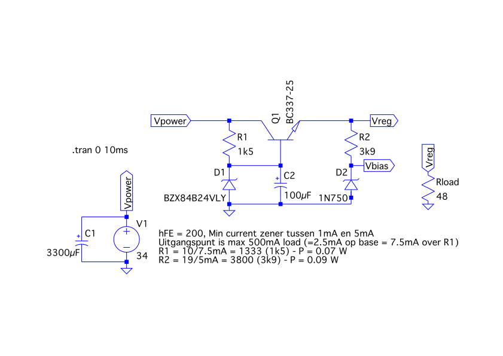
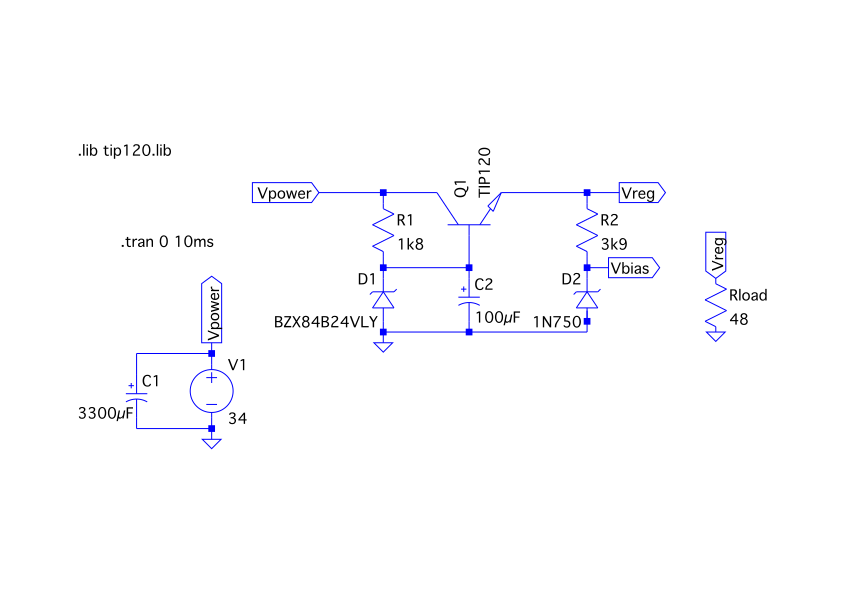

# calculator

A project to convert an old calculator into something new:

- Using a ESP32 processor
- Using a VFD display that can display characters, not only numbers.

# Power from the original calculator

We use the power from the original calculator:

1. GND
2. 34V power DC, via the original bridge rectifier and large 3300uF capacitor
3. 1.7V VF+ AC
4. 1.7V VF- AC
5. CT

(3) and (4) are directly connected to the filament of the VFD. (5) is connected to a special bias voltage, raising the filament AC voltage above ground (necessary to remove ghosting that might occur if GND is not the most negative part of the VFD).

(1) is the common ground for the whole circuit. (2) is the unregulated power that is send into the circuit below.

## 24V Circuit

### First try: BC337

The original calculator used a 24V Zener & Transistor to reduce toe voltage from 34V to 24V. However, the original calculator used a positive ground circuit, so we can't use that part of the circult (which used a PNP transistor, we need a NPN transistor for the negative ground circuit).

Let's see if we can get away with a regular BC337 NPN transistor. The hFE of a BC337 npn transistor is minimal 200. Working with a maximum output of 500mA, we need 2.5mA at the base of the transistor. We measured a typical 80mA current usage in the real circuit, so 500mA is more than enough.

A BZX55C24V zener diode is tested at 5mA and has a minimum of 1mA. A zener of 24V leaves 10V for R1. If we use R1 = 1k5, we get a current of 6.7mA, which leaves 4.2mA for the zener: more than enough. The power dissipation for R1 is 10*10/1500 = 0.07W, so we can use regular 0.25W resistors.

The BZX55C4V7 zener diode has the same current values. A zener of 4.7V leaves around 19V for R2. If we use R2 = 3k9, we get a current of 4.9mA. As the bias center tap will take a negligible current amount (measured: 0.7mA), we have enough current for the zener. The power dissipation for R2 is 19*19/3900 = 0.09W, so we can use regular 0.25W resistors.

However we've got a problem with this circuit. If we would have a collector current of 500mA at the transistor, and a voltage drop of 10V, the power dissipation would be 5W. A tiny BC337 can only handle 625mW (and would get pretty hot even then), thus would only be able to handle 62.5mA. This is not enough: we will not only provide power to the VFD, but our ESP32 will also need power (5V input for the development board).

Some other options:
- A BD139 BJT has a max power dissipation at Ta<25 of 1.25W, so our max current is around 125mA. With appropriate cooling, this can be increased.
- A TIP120 Darlington has a max power dissipation at Ta<25 of 2W, so our max current is around 200mA. With appropriate cooling, this can be increased.

The Darlington is probably a better solution, as the hFE of the Darlington is much larger than that of a BD139 (or any single NPN power transistor). We extra voltage drop between base and emiter is not a problem: we can always choose a different value for the Zener (actually: an emiter voltage of 22.7 is pretty OK for the VFD).

### Alternative: TIP120

Only difference with the previous circuit, is the replacement of the BC337 with a TIP120. We can now have an even higher value for R1, as the hFe of the TIP120 is at least 1000. The resulting voltage will be 22.7, which gives us a Vce = 11.3V. Without any cooling, 179mA can be handled by the transformer (at 2W), but the transformer will get hot. So we have to include a heatsink.

## 5V Circuit
We can use the 22.7V for the 5V circuit, by using a lineair 7805 regulator. The problem is - again - that we need to dissipate a lot of power. The ESP32 consumes (according to the datasheet) less than 100mA of current in normal operation, with WiFi this can increase to arround 300mA. The datasheet recomments a power supply of 500mA. 300mA with a voltage drop of 17.7 means 5.31W, 500mA means 8.85W (and the latter will make the TIP120 pretty hot as well).

Using a heatsink, we can probably get away with the power dissipation, as long as the ESP32 doesn't take that much current the whole time. Another solution might be to include a LM2596 step down buck converter. This converter has a maximum input voltage of 40V, so we can directly connect this to the 34V input, and not load the TIP120. In such a case, the TIP120 would only handle the VFD, and we don't have to use a heatsink. We don't need exactly 5V (a bit more or little is acceptable), as the devboard of the ESP32 contains a 3.3V regulator.
