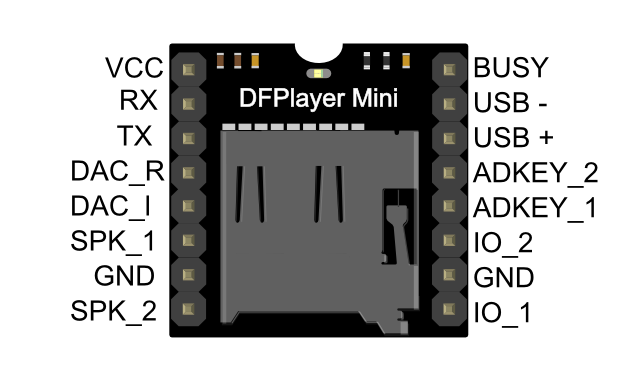
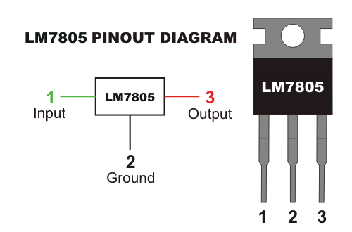
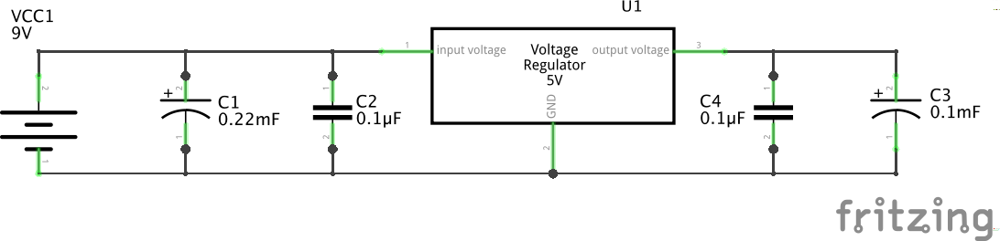

# DFPlayer audio

BOM:

- 2 9V batteries (for 18V power supply)
- 7805 power regulator (gives 5V for the dfplayer)
- Not sure: diode for a drop, to give the dfplayer 4.3V?
- Variable resistor (10K), a small one to set the volume to a "safe" level
- A large condensator, for power spikes (of the SD card reader)
- Two push buttons (for the df player operation)

|Pin|To|
|---|--|
| VCC | voltage from 7805 (pin 3)|
| RX | not used |
| TX | not used |
| DAC_R | not used |
| DAC_L | to input of variable resitor (pin 1) |
| SPK_1 | not used |
| GND | ground |
| SPK_2 | not used |
| BUSY | not used |
| USB - | not used |
| USB + | not used |
| ADKEY_2 | not used |
| ADKEY_1| not used |
| IO_2 | push button 2 |
| GND | ground |
| IO_1 | push button 1 |

7805:

- Pin 1 = input voltage (9V)
- Pin 2 = ground
- Pin 3 = output voltage (5V)

Create a regulated circuit with two 0.1uF capacitors, a 2700uF capacitor and a 1000uF capacitor

Variable resistor (screw top left)

- Pin 1 = input
- Pin 2 = output
- Pin 3 = ground

Output of variable transistor goes to +input of amp (-input = ground)
