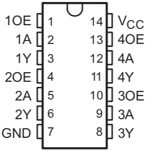
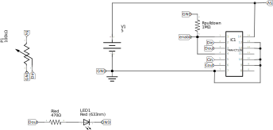
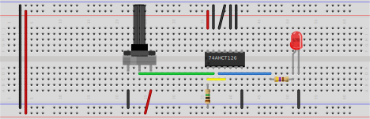

# 74AHCT126

A quad bus buffer gate. The difference between the HCT125 and HCT126 is the way the outputs are enabled: the HCT125 is enabled by connecting the OE to logical low (ground), the HCT126 is enabled by connecting the Output-Enable pins (OE) to logical high (anything above ~2V).

The datasheet states that unused inputs must be held at Vcc or GND. By holding the unused OE pins to ground, you don't have to to anything with the outputs. The datasheet also recommends to use a pull-down resistor on the OE's that are in use, to make sure that the outputs are not enabled during startup.

The datasheet also recommends to add a 0.1uF bypass capacitor as close to the Vcc pin as possible, the test circuit below doesn't include one.

## Test circuit

The circuit below is the test circuit, using fritzing. The circuit is already enabled for the SPI data and clock lines (Din/Dout and Cin/Cout) as we will use between the ESP32 and the APA102 leds. In the test, we will only use the Din and Dout pins.

The test will light the LED with 5V, the input voltage is controlled by the potmeter, ranging from 0V to 5V. In the test, the LED turns on around 1.7V, as expected. In the test configuration, the OE1 pin is connected directly to Vcc and the pull-down resistor is missing, in the final circuit, the OE1 pin will be connected to a 1Meg pull-down resistor and one of the free GPIO pins, setting that pin to HIGH as the last set in the setup routine.

