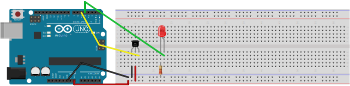

# Hall sensor

The test circuit is displayed below.

In its most simple form, the hall sensor detects the magnet, and the result is that the LED is turned on.

By using a INPUT_PULLUP pin setting, the output is logic HIGH when no magnet is present, and pulled to ground by the hall sensor when a magnet is present.

Mark that the sensor needs 5V, but the output of the hall sensor can have anything what is provided by the MCU board (5V in case of the Arduino UNO, but 3.3V in case of the ESP32).

For the ESP32, the interrupt routine should have the IRAM_ATTR attached.

The interrupt routine calculates the rotation speed, to be used to set the frame rate (after rotationSpeed/120 the next frame will be displayed), so with a rotation speed of 60 rpm, the frames will be displayed every 1/2 second.
