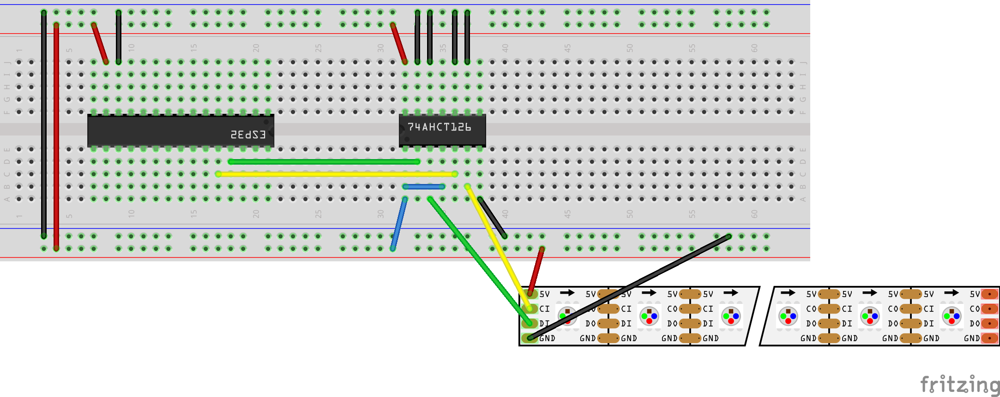

# APA102 LED strip

The APA102 LED strip uses a SPI bus for communication.

(The fritzing part can be found [here](https://github.com/sparkfun/Fritzing_Parts/blob/main/products/14015_14016_APA102_addressable_LED_strip.fzpz)).

## Arduino test

For testing purposes, we connect it to pin 11 and pin 13 of a Arduino UNO (the SPI ports). Notice that the power (5V) for the LED's are connected to Vin: the LEDs can draw a lot more power than the Arduino board can handle.

|APA102|Arduino pin|Assignment|
|------|-----------|----------|
||10|SS (Slave Select, we don't use this one)
|DI|11|MOSI (Master output - Slave Input), the SPI output)|
||12|MISO (Master input - Slave output), the SPI input: we don't use this one|
|CI|13|SCK - Clock|

[This](https://learn.sparkfun.com/tutorials/apa102-addressable-led-hookup-guide/hardware-hookup) instruction guide recommends to connect quite a large capacitor (1000uF) as close to the power line of the LED strip as possible.

## ESP32 test

|APA102|ESP32 pin|Assignment|
|------|-----------|----------|
||5|SS (Slave Select, we don't use this one)
|DI|23|MOSI (Master output - Slave Input), the SPI output)|
||19|MISO (Master input - Slave output), the SPI input: we don't use this one|
|CI|18|SCK - Clock|

We need to use the 74AHCT126 to get al this working, so... This first test uses a direct connection between OE en 5V, this should be changed to a pin of the ESP32. Pin 17 seems a good option. Care should be taken that non of the ESP32 pins are per change connected to a 5V line!

As the 74AHCT126 will also work with the Arduino, we could first simple test if the arduino version works, and than translate this to the ESP32 variant.
