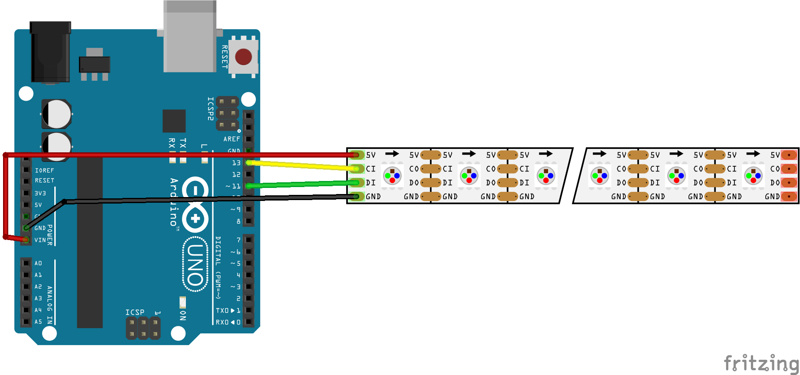

# APA102 LED strip

The APA102 LED strip uses a SPI bus for communication.

(The fritzing part can be found [here](https://github.com/sparkfun/Fritzing_Parts/blob/main/products/14015_14016_APA102_addressable_LED_strip.fzpz)).

For testing purposes, we connect it to pin 11 and pin 13 of a Arduino UNO (the SPI ports). Notice that the power (5V) for the LED's are connected to Vin: the LEDs can draw a lot more power than the Arduino board can handle.

|Pin|Assignment|
|---|----------|
|10|SS (Slave Select, we don't use this one)
|11|MOSI (Master output - Slave Input), the SPI output)|
|12|MISO (Master input - Slave output), the SPI input: we don't use this one|
|13|SCK - Clock|

[This](https://learn.sparkfun.com/tutorials/apa102-addressable-led-hookup-guide/hardware-hookup) instruction guide recommends to connect quite a large capacitor (1000uF) as close to the power line of the LED strip as possible.
