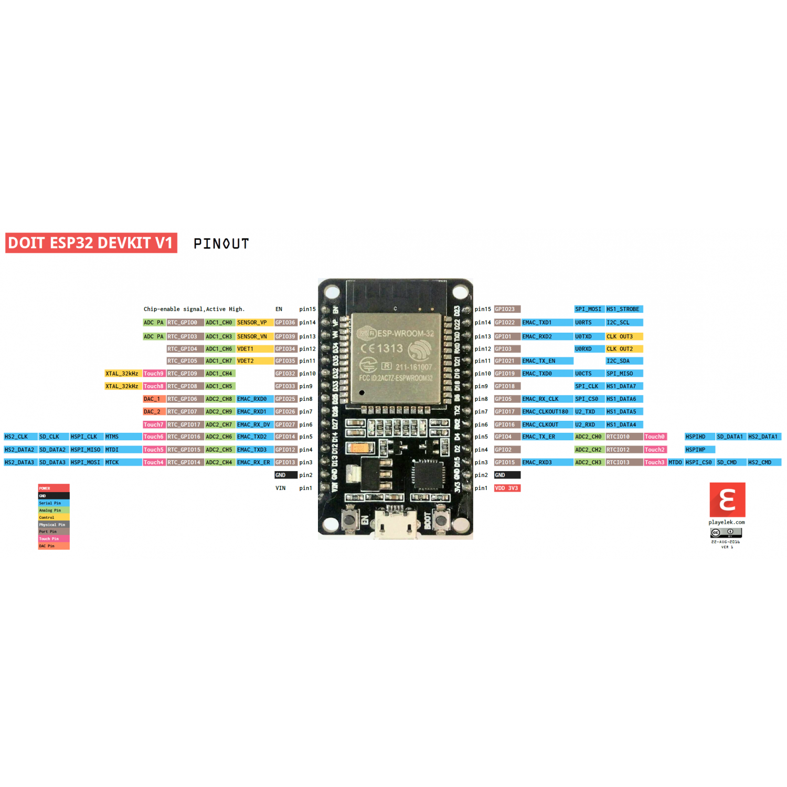

# ESP32

Not sure which one to use, the one below seems appropriate.

The ESP32 board has two SPI buses, have to find out which one to use.

According to [this addition](https://github.com/FastLED/FastLED/pull/1047/files) to the FastLED library, by default the VSPI bus is used (pins 18, 19, 23 & 5).

|APA102|Arduino Pin|ESP32 VSPI|Assignment|
|------|-----------|----------|----------|
||10|GPIO-5|SS (Slave Select, we don't use this one)
|DI|11|GPIO-23|MOSI (Master output - Slave Input), the SPI output)|
||12|GPIO-19|MISO (Master input - Slave output), the SPI input: we don't use this one|
|CI|13|GPIO-18|SCK - Clock|

- Using "ESP32 Dev Board" / COM10 as the ESP32 board in the Arduino IDE (is this correct? Seems to work...);
- Using Pin 22 as internal LED pin for the blink test

Another one:

This first one works, although putting to much in the setup() routines doesn't work...

## DFRobot ESP32 Beetle

This one is quite small, but works better with small power supply. Unfortunately, this board has only 4 usable digital pins (D2, D3, D4 and D7). According to the [schematic](https://dfimg.dfrobot.com/nobody/wiki/7b54fd959282196194c6370a9b2a8f2d.pdf), this corresponds to GPIO pins 25, 26, 27 and 13. Fortunately, we only need 4. But... we want to use the SPI bus and these are different pins. It seems that pins 25/26/27 can also be used for SPI, but [reduces](https://docs.espressif.com/projects/esp-idf/en/latest/esp32/api-reference/peripherals/spi_master.html) the SPI bus speed from 80 Mhz to 40 Mhz, which will be pretty OK and probably much better than bitbanging! => It uses the GPIO Matrix.

The [rerouting](https://www.esp32.com/viewtopic.php?t=1929) is done as part of the SPI library implementation of the ESP32, so we don't have to do anything different, except for the call to the begin() statement: we need to set the custom MOSI en CLK pins.

- Using "Firebeetle ESP32" as the ESP32 board in the Arduino IDE;
- Using D9 as internal LED pin for the blink test
