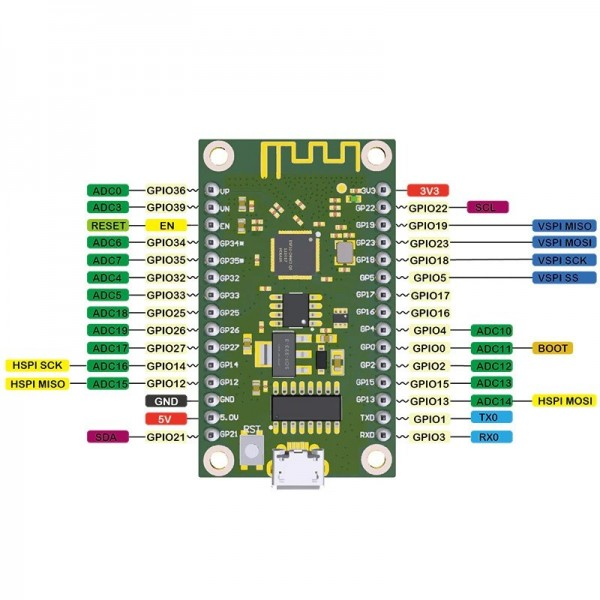

# ESP32

Not sure which one to use, the one below seems appropriate.

The ESP32 board has two SPI buses, have to find out which one to use.

According to [this addition](https://github.com/FastLED/FastLED/pull/1047/files) to the FastLED library, by default the VSPI bus is used (pins 18, 19, 23 & 5).

|APA102|Arduino Pin|ESP32 VSPI|Assignment|
|------|-----------|----------|----------|
||10|GPIO-5|SS (Slave Select, we don't use this one)
|DI|11|GPIO-23|MOSI (Master output - Slave Input), the SPI output)|
||12|GPIO-19|MISO (Master input - Slave output), the SPI input: we don't use this one|
|CI|13|GPIO-18|SCK - Clock|

Strangly enough: it doesn't work.. even the bitbanging doesn't work... mmmm...

Another one:

