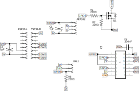
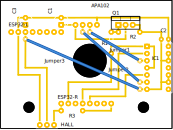

# PCB

The PCB will be placed on top of the circula disc that is part of the rotor axis. The circuit below contains the parts involved.

- The ESP32 pins are not all used: only the top right and bottom left pins are used and actually placed on the PCB, leaving the other pins dangling in the air :-)
- A capacitor is placed close to the power pins of the ESP32
- The LEDs are depicted as a four pin jumper, with another (large) capacitor
- The MOSFET contains both resistors, the one to ground for "clearing" the MOSFET after power shutdown, and the current limiting resistor to the gate pin.
- The hall sensor is depicted as a three pin jumper, with the pull-up resistor to the 3.3V pin of the ESP32
- The level shifter contains a small 0.2uF capacitor, as according to the datasheet.

This results in the following PCB layout:

The holes for the fitting screws are visible in the bottom part of the pcb. The large hole in the middle is for the centre area of the axis. Although it could be used as part of the circuit, we don't use it, so we don't have to isolate the (metal) axis from the PCB board.
